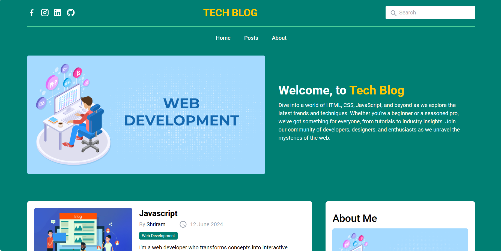
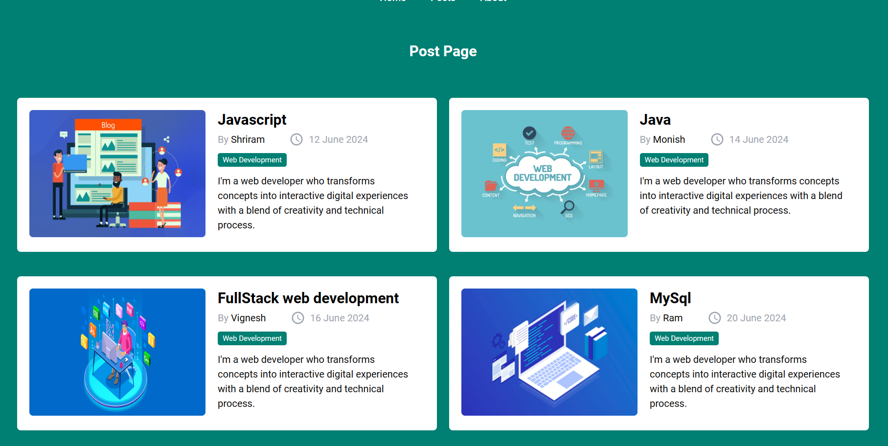
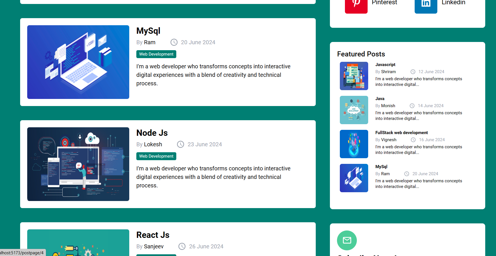

# Tech Blog - React

Welcome to our tech blog built with React! This blog focuses on web development topics such as HTML, JavaScript, JS DOM, Tailwind CSS, and ReactJS. 

## Table of Contents
- [Screenshots](#screenshots)
- [Installation](#installation)
- [Usage](#usage)
- [Features](#features)

## Screenshots
- **ScreenShot 1**
  
- **ScreenShot 2**  
     
- **ScreenShot 3**  
     


## Installation

1. Clone the repository:

```bash
git clone https://github.com/san1234100/tech-blog.git
```
2. Navigate into the project directory:
```bash
cd tech-blog
```

3. Install dependencies using npm or yarn:
```bash
npm install
```

4. Start the development server:
```bash
npm run dev
```


## Usage
 
- Open your web browser and go to http://localhost:3000.


## Features
- Browse through a collection of blog posts related to web development.
- Learn about various concepts and techniques in HTML, JavaScript, JS DOM, Tailwind CSS, and ReactJS.
- Easy navigation and user-friendly interface.


# Happy coding!😁🧑‍💻